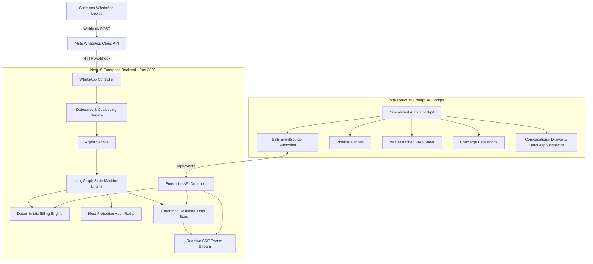

# Dil Se Catering • Enterprise System Architecture

An autonomous, multi-modal catering intelligence platform engineered for British-Indian luxury banqueting, corporate galas, and wedding feasts in the Greater London & South-East area.

---

## 1. High-Level Architecture Overview



---

## 2. Directory Structure

```
Catering/
├── data/                             # Persistent runtime JSON database store
├── docs/                             # Engineering, Architecture & Design Specs
│   ├── ARCHITECTURE.md               # System architectural blueprint
│   ├── DESIGN_SYSTEM.md              # Warm Regal Editorial Minimalist tokens
│   └── PLAN.md                       # Roadmap & execution milestones
├── frontend/                         # Vite + React 19 Enterprise Operations Cockpit
│   ├── src/
│   │   ├── components/
│   │   │   ├── admin/                # Cockpit Views, Modals & Drawers
│   │   │   │   ├── ConversationalDrawer/
│   │   │   │   ├── EscalationsView/
│   │   │   │   ├── KitchenPrepSheet/
│   │   │   │   ├── LogisticsView/
│   │   │   │   ├── MenuCatalogView/
│   │   │   │   ├── OrderKanban/
│   │   │   │   ├── Sidebar/
│   │   │   │   ├── StatsBar/
│   │   │   │   ├── TopBar/
│   │   │   │   └── index.ts          # Consolidated Barrel Export
│   │   │   └── common/               # Shared Reusable Elements (RoyalCrest, etc.)
│   │   ├── services/                 # API Client & Server-Sent Events (SSE)
│   │   ├── styles/                   # HSL Tokens, Variables & Global Reset
│   │   ├── types/                    # TypeScript Data Interfaces
│   │   ├── App.tsx                   # Cockpit Root & Live Push Subscriber
│   │   └── main.tsx                  # React DOM Root
│   ├── vercel.json                   # Production SPA Rewrite & Security Headers
│   └── vite.config.ts                # Build Configuration & Local Dev Proxy
├── prisma/
│   └── schema.prisma                 # Optional relational PostgreSQL schema
├── scripts/                          # Admin Maintenance, Seeding & Simulation CLI
├── src/                              # NestJS Modular Backend
│   ├── agent/                        # Autonomous AI Agent Core
│   │   ├── billing/                  # Deterministic Billing & Trays Engine
│   │   ├── graph/                    # LangGraph State Graph & Node Reducers
│   │   ├── prompts/                  # Hospitality & British-Indian Prompts
│   │   ├── protection/               # Dietary Host-Protection Radar
│   │   ├── tools/                    # Tool Calling Definitions
│   │   └── agent.service.ts          # Agent Orchestrator & Telemetry Emitter
│   ├── menu/                         # Menu Catalog & Dual-Pricing Service
│   ├── api/                          # REST API & Real-Time Push Gateway
│   │   ├── dto/                      # Data Transfer Objects
│   │   ├── api.controller.ts         # REST Endpoints & /api/events SSE Stream
│   │   └── api.module.ts
│   ├── common/                       # PII Masking & Security Utilities
│   ├── config/                       # Type-safe Configuration Provider
│   ├── database/                     # High-Speed In-Memory & File Store
│   ├── events/                       # Reactive Server-Sent Events (SSE) Module
│   ├── whatsapp/                     # Meta Cloud API, Voice Notes & Audio Transcriber
│   │   ├── dto/
│   │   ├── whatsapp.controller.ts
│   │   ├── whatsapp.service.ts
│   │   └── whatsapp-debounce.service.ts
│   ├── app.module.ts
│   └── main.ts
├── test/                             # Automated E2E & Vitest Integration Suites
│   └── fixtures/                     # Mock Webhooks & Audio Samples
├── package.json                      # Workspace Scripts & Dependencies
├── render.yaml                       # Render Web Service Blueprint (API Service)
└── tsconfig.json                     # Strict TypeScript Configuration
```

---

## 3. Core Subsystems

### A. Reactive Server-Sent Events (SSE)
* **Endpoint**: `GET /api/events`
* **Protocol**: Text-based event streaming (`text/event-stream`) with automatic 20-second heartbeat ping.
* **Payloads**: Zero-latency push broadcasts for new orders, status transitions, live customer chats, and concierge handoffs.

### B. Multimodal Voice Note Processing
* **Input**: WhatsApp Voice Notes (`audio/ogg; codecs=opus`).
* **Transcription**: Native Gemini 2.5 Flash / OpenAI Whisper transcribing Hinglish, Hindi, and regional speech into structured banquet parameters.

### C. Deterministic Billing & Host-Protection Radar
* **Rule Engine**: 100% deterministic pricing with tiered per-head discounts, mileage dispatch surcharges, and guest minimum thresholds.
* **Host-Protection Radar**: Automatically flags under-cushioned vegetarian/meat ratios, informs host of "stealth meat-eaters," and guards event reputation.
